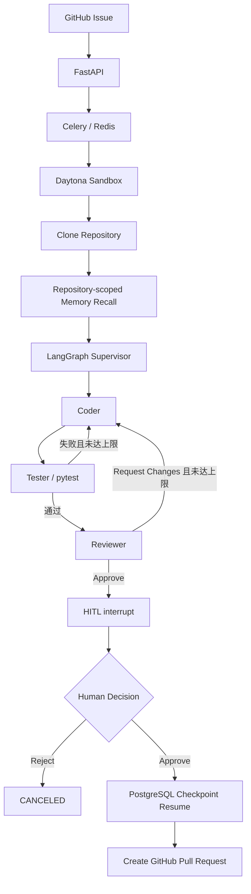
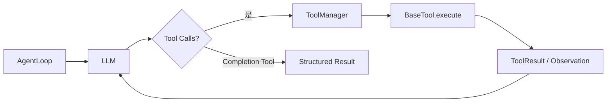

# NexusCoder

> 基于 LangGraph 的 Multi-Agent Coding Agent：从 GitHub Issue 接收任务，在隔离 Sandbox 中完成编码、测试与审查，经人工批准后创建 Pull Request。

NexusCoder 将一次编码任务拆分为可追踪、可重试、可暂停恢复的工作流。FastAPI 接收请求并校验 GitHub Repository 权限，Celery 在后台执行长任务，LangGraph 编排 Supervisor、Coder、Tester、Reviewer 和 Human Approval，Daytona 提供隔离执行环境，PostgreSQL 同时保存业务状态、长期记忆和 LangGraph Checkpoint。

项目当前处于持续开发阶段，不应视为 production-ready。本文只描述当前仓库中已经实现的能力、已有验证记录和已知限制。

## Overview

传统的单轮代码生成很难覆盖完整的软件交付过程：模型不仅要修改文件，还要理解 Repository、运行测试、处理失败反馈、审查最终 Diff，并在产生外部副作用前让人确认。

NexusCoder 为此提供两层执行模型：

- **Outer Workflow**：LangGraph `StateGraph` 管理 `Supervisor → Coder → Tester → Reviewer → Human Approval`，负责路由、重试、状态持久化和恢复。
- **Inner Agent Loop**：Coder 与 Reviewer 内部使用 `AgentLoop`，重复执行 `LLM → Tool Call → Observation → LLM`，直到 Completion Tool 返回结构化结果，或达到迭代、Token、Tool Call 上限。

当前主链路面向 GitHub Issue：任务完成后，Coder 先把分支推送到远端；只有自动测试通过、Reviewer 批准且人工确认后，外层任务才调用 GitHub API 创建 Pull Request。

## Core Workflow



Supervisor 当前最多累计 3 次测试或审查重试。测试持续失败、Coder/Reviewer Runtime 失败，或人工拒绝时，工作流会以明确的失败或取消状态结束。

## Architecture

| 层次 | 当前职责 | 主要实现 |
| --- | --- | --- |
| API | GitHub OAuth、Installation 同步、Issue 查询、任务启动、人工批准/拒绝 | FastAPI，`backend/app/api/` |
| Background Task | 执行长时间 Agent 任务、维护 `AgentRun` 状态、处理重试和最终 PR 副作用 | Celery、Redis，`backend/app/tasks/` |
| Outer Workflow | 多 Agent 路由、质量门禁、重试、HITL | LangGraph `StateGraph`，`backend/app/agents/multi_agent/` |
| Inner Agent Loop | 模型调用、Tool Calling、Observation 回填、Completion 检测和资源上限 | `BaseAgent`、`AgentLoop` |
| Tools | 文件、Git、Shell、测试、Lint、Diff 和 Completion Tool | `backend/app/agents/tools/` |
| Sandbox | 隔离执行、Repository clone、命令与 Git 操作 | Daytona、`MockSandbox` |
| Persistence | 用户、Installation、Review、AgentRun、Memory | PostgreSQL、SQLAlchemy、Alembic |
| Workflow Persistence | 按 `thread_id` 保存和恢复 LangGraph 状态 | PostgreSQL Checkpointer |
| Long-Term Memory | 成功任务经验提炼、Embedding、Repository 级召回 | PostgreSQL、pgvector |
| Observability | Workflow Trace、Memory Trace、Agent 消息轨迹和 Token/Cache 指标 | LangSmith、`AgentRun`、Graph State |

FastAPI 不直接执行耗时的 Coding Workflow。它创建 `AgentRun` 并向 Celery 投递轻量任务；Worker 负责获取 GitHub 凭据、创建 Sandbox、运行 Graph、保存状态并处理 PR 创建。这使 HTTP 请求生命周期与长时间、可重试的 Agent 任务相互隔离。

## Multi-Agent Design

### Supervisor

Supervisor 是确定性的路由节点，不调用 LLM。它根据当前节点结果选择 Coder、Tester、Reviewer、Human Approval 或结束流程：

- Coder 必须通过 `finish_task` 返回完成状态，才能进入 Tester。
- Tester 失败会把测试结果反馈给下一轮 Coder。
- Reviewer 返回 `REQUEST_CHANGES` 时会把审查结果反馈给 Coder。
- 达到重试上限后停止，避免无限循环。
- Reviewer 批准且启用 HITL 时，路由到 Human Approval。

### Coder

Coder 使用 `BackgroundAgent + AgentLoop`。它接收 Issue、Repository 信息、定制指令、已召回 Memory，以及上一轮测试/审查反馈；可使用文件 CRUD、Git、Shell、测试、Lint 和 Completion Tools 完成任务。

当前 Tool 集覆盖：

- 读取、列出、搜索、替换、创建和删除文件；
- 查看、创建和切换分支，执行 add、commit、push、pull；
- 运行代码、Shell 命令、pytest 或其他已支持测试命令；
- 通过 `finish_task` 返回 summary、branch name 和变更文件。

### Tester

Tester 是确定性节点，不使用 LLM。它在 Sandbox 的 `workspace/repo` 中执行 `pytest`，并仅以进程退出码判断是否通过。失败输出进入 Graph State，供 Supervisor 和下一轮 Coder 使用。

### Reviewer

Reviewer 先确定性获取 `base_branch...HEAD` 的完整 Git Diff，再启动 `ReviewAgent + AgentLoop`。Reviewer 拥有只读文件/Git 能力以及测试、Lint、命令和 Diff Tools，最终通过 `finish_review` 返回 `APPROVE`、`REQUEST_CHANGES` 或 `COMMENT`。

### Human Approval

当自动测试与 Reviewer 均通过后，`human_approval_node` 调用 LangGraph `interrupt()`。此时业务状态写为 `WAITING_FOR_APPROVAL`。用户可以通过 API 提交批准或拒绝：

- **Approve**：使用原 `AgentRun` ID 恢复 Checkpoint，随后创建 PR。
- **Reject**：恢复 Graph 并将任务标记为 `CANCELED`，不会创建 PR。

## Agent Runtime

`BaseAgent` 和 `AgentLoop` 构成单个 LLM Agent 的通用 Runtime：



- `BaseAgent` 维护 system/user/tool 消息、执行状态、迭代次数和用量。
- `ToolManager` 将 Tool 转换为 OpenAI-compatible function schema，并按名称分发调用；同一轮多个 Tool Call 可并发执行。
- `BaseTool` 统一 Tool 定义和 `ToolResult` 结构。
- Completion Tools 不执行外部副作用，而是以 `metadata.type=completion` 通知 AgentLoop 正常结束。
- Runtime 默认设置迭代、Token 和 Tool Call 上限，避免无界执行。
- LLM 接入由 LiteLLM 封装，当前默认模型配置为 `deepseek/deepseek-v4-flash`；实际 Provider 由 `MODEL_NAME` 和对应凭据决定。

## Sandbox Execution

真实 Coding Workflow 使用 Daytona Sandbox：

- 为每次 Agent Run 创建隔离 Runtime；
- 将授权 Repository clone 到固定的 `workspace/repo`；
- 在 Sandbox 内执行文件、Shell、pytest 和 Git 操作；
- 允许 Coder 创建分支、Commit 并 Push；
- 任务结束后由 `SandboxManager` 释放资源。

`MockSandbox` 用于单元测试与 Evaluation。它在本机临时目录创建最小 Git Repository，提供与 Daytona 相近的文件、进程和 Git 接口，并包含 `login_500`、`empty_average` 两套 fixture。MockSandbox 不是安全隔离边界，不应替代真实 Daytona 用于不可信代码。

## HITL & Persistence

NexusCoder 使用两类持久化，职责不同：

1. **业务状态**：SQLAlchemy `AgentRun` 保存 `PENDING`、`RUNNING`、`WAITING_FOR_APPROVAL`、`COMPLETED`、`FAILED`、`CANCELED` 状态，以及消息轨迹、Token、Tool Call、Branch 和 PR 信息。
2. **Graph 状态**：LangGraph `AsyncPostgresSaver` 使用 `thread_id` 保存执行位置和 State。

启动 Workflow 时，`thread_id` 使用 `AgentRun.id`。人工决策到达后，恢复任务使用完全相同的 `thread_id` 和 `Command(resume=approved)`，因此可以从 `interrupt()` 的位置继续，而不是重新运行 Coder、Tester 和 Reviewer。PR 创建被放在人工批准之后，避免未经确认就产生最终 GitHub 外部副作用。

## Long-Term Memory

长期记忆用于跨任务复用同一 Repository 的经验，而不是保存完整聊天记录：

- **SEMANTIC**：相对稳定的仓库知识，例如测试命令或模块约定；相同 `repository + memory_key` 会更新已有知识。
- **EPISODIC**：某次成功任务形成的可复用经验；不同 AgentRun 可保留独立历史，并设置默认过期时间。
- 成功任务提炼服务可由 LLM 生成 0～3 条候选 Memory；写入策略要求任务成功、测试通过、Reviewer 未拒绝且没有被人工拒绝。
- Memory 使用 Embedding 存入 pgvector；召回时先限定 Repository，再按余弦距离与 importance 排序，并过滤失效或过期记录。
- 当前 Coding Workflow 使用 Issue 标题和正文作为查询，最多召回 5 条 Memory 注入 Coder 上下文。

当前主链路已经接入任务开始前的 Memory Recall。需要注意的是，主流程目前强制进入 HITL，而人工批准后的 resume 分支尚未调用 `remember_successful_run`；因此不能声称每个获批任务都会自动提炼并写回长期记忆。写入服务、策略与测试已经存在，但 HITL 成功路径的自动接线仍待补齐。

这里的 Memory 与通用 RAG 有交集，但目标不同：RAG 通常从外部文档或完整知识库检索事实；当前实现只检索由历史成功 AgentRun 提炼出的 Repository 级经验。项目尚未实现面向整个代码库或任意文档集合的通用向量化 RAG。

## Evaluation

### Mock Evaluation

Mock Evaluation 使用 `MockLLM + MockSandbox`，以确定性场景验证 Graph 路由和指标聚合。目前 Dataset 包含：正常成功、Reviewer 首轮拒绝、Tester 首轮失败、Tester 持续失败并达到最大重试次数。

```powershell
cd backend
python scripts/run_evaluation.py
```

### Real LLM Evaluation v1

Real LLM Evaluation 使用真实 LiteLLM Client，但仍使用本地 `MockSandbox` fixture，因此它验证的是 Coder/Reviewer 的真实模型行为和完整 Multi-Agent 逻辑，不等同于真实 Daytona/GitHub E2E。

当前 v1 只有两个 representative cases：

- `real_login_500_fix`
- `real_empty_average_fix`

已有运行记录如下：

| 指标 | 结果 |
| --- | ---: |
| Benchmark cases passed | 2 / 2 |
| Workflow Success | 100% |
| Final Test Pass | 100% |
| Reviewer Approval | 100% |
| Retry Cases | 0 |
| Total Tokens | 166,953 |
| Cache Hit Rate | 93.73% |

这些数据只代表当前 Real LLM Evaluation v1 的两个案例，不构成大规模 Benchmark，也不能据此推断复杂真实项目上的整体成功率。

运行真实模型评测前，需要设置 `MOCK_LLM=false`、正确的 `MODEL_NAME` 和对应 Provider API Key；运行会产生真实模型调用和费用：

```powershell
cd backend
python scripts/run_real_evaluation.py
```

Evaluation Runner 会分别统计 Workflow success、最终测试结果、Reviewer verdict、重试次数、Coder/Reviewer Token、Prompt/Completion Token，以及模型返回的 Cache hit/miss Token。

## Observability

- LangSmith 可通过 `LANGSMITH_TRACING` 启用，并覆盖 Multi-Agent Workflow、HITL resume、Memory recall 和 Memory extraction。
- Trace 配置会隐藏 Issue Body、系统 Prompt、对话消息等敏感正文，只保留必要结构和元数据。
- `AgentRun` 保存最近执行轨迹、迭代次数、Token 总量和 Tool Call 数量，供 API 与前端查看。
- Graph State 分别累计 Coder 和 Reviewer 的 run count、prompt/completion Token、cache hit/miss Token。
- Celery 记录任务开始、结束、重试和失败事件。

当前可观测性以执行诊断和评测统计为主，不包含完整的生产监控、告警或分布式指标平台。

## GitHub Integration

当前 GitHub 集成包括：

- GitHub OAuth 登录；
- GitHub App JWT 和短期 Installation Token；
- Installation 与授权 Repository 同步；
- 按当前用户和 Installation 校验 Repository 权限；
- 查询 Issue、Issue 评论和 Repository 默认分支；
- 在 Sandbox 中创建 Branch、Commit、Push；
- 人工批准后通过 GitHub API 创建 Pull Request；
- 既有 PR Review/Summary 任务及行级、文件级 Review 评论能力。

主 Coding 链路为：

```text
Issue → AgentRun → Celery → Sandbox → Branch → Code/Test/Review
      → WAITING_FOR_APPROVAL → Approve → Checkpoint Resume → Pull Request
```

## Real GitHub E2E

项目已经完成过一次真实的 Issue → PR 全链路验证。该次验证使用真实 GitHub 流程和 Daytona Sandbox，完成了：

- 从 GitHub Issue 启动后台任务；
- clone Repository 并召回 Repository-scoped Memory；
- Coder 定位并修复 Python 空列表导致的 `ZeroDivisionError`；
- 创建 Branch、修改文件、执行 pytest、Commit 并 Push；
- Tester 独立执行测试并通过；
- Reviewer 返回 `APPROVE`；
- Workflow 进入 `WAITING_FOR_APPROVAL`；
- 人工批准后通过 PostgreSQL Checkpoint 恢复；
- 最终创建 GitHub Pull Request。

这里不公开测试 Repository、用户、Installation、AgentRun ID 或其他私人测试数据。该记录证明这条链路曾经端到端跑通，但不代表当前任意提交、任意 Repository 或任意任务都必然成功。

## Project Structure

```text
.
├── backend/
│   ├── app/
│   │   ├── agents/
│   │   │   ├── multi_agent/   # StateGraph、Supervisor、各 Agent Node、HITL
│   │   │   ├── tools/         # File、Git、Process、Diff、Completion Tools
│   │   │   ├── sandbox/       # Daytona adapter、生命周期管理、MockSandbox
│   │   │   └── memory/        # 提炼、策略、Embedding、召回与存储
│   │   ├── api/               # FastAPI routers
│   │   ├── tasks/             # Celery 后台任务与 HITL resume
│   │   ├── models/            # SQLAlchemy 业务模型
│   │   ├── evaluation/        # Dataset、Runner 与指标聚合
│   │   └── core/              # 配置、LLM Client、Celery、LangSmith
│   ├── alembic/               # 数据库迁移
│   ├── scripts/               # Checkpoint 初始化、Evaluation、Smoke scripts
│   └── tests/
├── frontend/                  # React 19、TypeScript、Vite 前端
├── docker-compose.dev.yml     # 本地开发服务编排
└── LICENSE
```

仓库根目录当前没有独立的 `scripts/`；运行脚本位于 `backend/scripts/`。

## Quick Start

### 1. 前置条件

- Python 3.10 或更高版本；
- PostgreSQL 16；Memory 功能需要安装 pgvector 扩展；
- Redis 7；
- `uv`；
- 运行真实链路时需要 GitHub App/OAuth、Daytona 和所选 LLM Provider 的凭据。

仓库的 `docker-compose.dev.yml` 可以启动 PostgreSQL 和 Redis，但当前 PostgreSQL 镜像是标准 `postgres:16-alpine`，没有在 Compose 中安装或初始化 pgvector。若要执行包含 Memory Embedding 的全部 Migration，请使用已安装 pgvector 的 PostgreSQL 实例。不要把现有 Compose 理解为已经完整配置好 Memory 数据库。

```powershell
docker compose -f docker-compose.dev.yml up -d postgres redis
```

### 2. 安装后端依赖

```powershell
cd backend
uv sync
.\.venv\Scripts\Activate.ps1
```

### 3. 配置环境变量

在 `backend/.env` 中配置环境变量。下面只有变量名和 placeholder，不包含真实 Secret：

```dotenv
MOCK_LLM=true
MOCK_SANDBOX=true
MOCK_EMBEDDING=true

MODEL_NAME=deepseek/deepseek-v4-flash
DEEPSEEK_API_KEY=<deepseek-api-key>
OPENAI_API_KEY=<embedding-provider-api-key>

DATABASE_URL=postgresql+asyncpg://<db-user>:<db-password>@localhost:5432/<db-name>
REDIS_URL=redis://localhost:6379/0
CELERY_BROKER_URL=redis://localhost:6379/0
CELERY_RESULT_BACKEND=redis://localhost:6379/1

JWT_SECRET_KEY=<random-jwt-secret>
ENCRYPTION_KEY=<fernet-compatible-key>
FRONTEND_URL=http://localhost:5173

GITHUB_APP_ID=<github-app-id>
GITHUB_APP_NAME=<github-app-name>
GITHUB_CLIENT_ID=<github-oauth-client-id>
GITHUB_CLIENT_SECRET_ID=<github-oauth-client-secret>
GITHUB_WEBHOOK_SECRET=<github-webhook-secret>
GITHUB_SECRET_KEY_PATH=<path-to-github-app-private-key>

DAYTONA_API_KEY=<daytona-api-key>
DAYTONA_API_URL=<daytona-api-url>
DAYTONA_TARGET=<daytona-target>

LANGSMITH_TRACING=false
LANGSMITH_API_KEY=<langsmith-api-key>
LANGSMITH_ENDPOINT=<langsmith-endpoint>
LANGSMITH_PROJECT=<langsmith-project>
```

本地 Mock 开发可以保持 `MOCK_LLM=true`、`MOCK_SANDBOX=true` 和 `MOCK_EMBEDDING=true`。真实 GitHub/Daytona Workflow 需要将相关 Mock 开关设为 `false` 并提供对应凭据。

### 4. 初始化数据库与 LangGraph Checkpoint

确认目标 PostgreSQL 已支持 pgvector 后执行：

```powershell
alembic upgrade head
python scripts/init_langgraph_checkpoint.py
```

Alembic 管理 NexusCoder 的业务表；`init_langgraph_checkpoint.py` 调用 LangGraph Checkpointer 自己的 `setup()` 创建 Checkpoint 表。

### 5. 启动 FastAPI

```powershell
python -m uvicorn app.main:app --reload
```

- API：`http://localhost:8000`
- Swagger UI：`http://localhost:8000/api/docs`
- Health Check：`http://localhost:8000/health`

### 6. 启动 Celery Worker（Windows）

在另一个已激活后端虚拟环境的 PowerShell 中运行：

```powershell
celery -A app.core.celery_app.celery_app worker --loglevel=info --pool=solo
```

Windows 使用 `--pool=solo`，避免默认多进程模型带来的兼容性问题。

### 7. 可选：启动前端

```powershell
cd frontend
corepack pnpm install
corepack pnpm dev
```

前端默认开发地址为 `http://localhost:5173`。

## Design Decisions

- **FastAPI + Celery**：API 负责认证、校验和任务投递；Celery 负责耗时、可重试的 Agent 执行，避免阻塞 HTTP 请求。
- **LangGraph 管 Outer Workflow**：多节点路由、失败反馈、重试与 interrupt/resume 是状态机问题，使用显式 Graph 比把流程隐藏在 Prompt 中更可测试。
- **AgentLoop 管 Inner Loop**：单个 Agent 的模型调用与 Tool 循环可复用，Coder 和 Reviewer 不需要各自实现一套执行引擎。
- **Tester 使用确定性 pytest**：测试是否通过由进程退出码决定，不交给 LLM 猜测。
- **Reviewer 使用 LLM**：审查需要结合 Diff、语义和工程上下文，但最终仍输出受约束的结构化 verdict。
- **隔离 Sandbox**：Agent 可以运行命令和修改文件，这类高权限操作不应直接发生在 API/Worker 宿主文件系统中。
- **PR 前置 HITL**：Branch 可以先用于保存 Agent 产物，但创建最终 PR 前仍需人工确认，降低错误外部副作用。
- **PostgreSQL Checkpoint**：审批可能跨进程、跨时间发生，持久化 Checkpoint 比依赖 Worker 内存更可靠。
- **Memory 不等于通用 RAG**：Memory 保存经过成功任务提炼的 Repository 经验；当前没有构建通用文档或整库代码检索平台。

## Current Status

### Implemented

- FastAPI、Celery、Redis 后台任务链路；
- LangGraph Multi-Agent StateGraph、Supervisor 路由和最多 3 次重试；
- Coder、确定性 Tester、LLM Reviewer、HITL interrupt/resume；
- Daytona Sandbox adapter、Repository clone、文件/Git/命令 Tools；
- PostgreSQL Checkpointer 和 `AgentRun` 持久化；
- Repository-scoped Semantic/Episodic Memory 与 pgvector 检索；
- Mock/Real LLM Evaluation Runner 与 Token/Cache 指标；
- LangSmith Trace 和敏感字段脱敏；
- GitHub OAuth、App Installation、Issue 查询、Branch Push 和 PR 创建。

### Validated

- 曾完成一次真实 GitHub Issue → Daytona → Multi-Agent → HITL → PostgreSQL resume → Pull Request E2E。
- Real LLM Evaluation v1 的两个 representative cases 已记录为 2/2 通过；这不是大规模 Benchmark。
- 重新运行了 18 个不需要真实 Secret 的核心测试，结果为 `18 passed, 0 failed, 19 warnings`；Multi-Agent、HITL、Evaluation Runner、Supervisor、Evaluation metrics 和 Memory extractor 等核心测试均已通过。
- 19 个 warning 主要来自 `pytest-asyncio` 弃用提示与 pytest cache 写入提示，不属于测试失败。

### Known Limitations

此外，Memory Recall 已进入当前 HITL 主链路，但获批后的 resume 分支尚未自动调用长期记忆提炼/写入服务；目前应将 Memory 描述为“读取链路已接入、写回组件已实现但主路径接线未完成”。

### Future Improvements

- 在 HITL approve/resume 成功路径接入 `remember_successful_run`；
- 为本地 PostgreSQL 开发环境补齐明确、可重复的 pgvector 初始化方案；
- 扩充 Real LLM Evaluation 数据集并保存可审计的版本化运行报告；
- 增加更多语言、测试框架、复杂 Repository 和失败恢复案例；
- 完善生产部署、监控告警、权限隔离和 Sandbox 资源治理；
- 持续减少 Trace 和持久化数据中的敏感信息暴露面。

## License / Acknowledgements

本项目使用 [MIT License](LICENSE)。现有许可证保留了原作者 `Kacem Mathlouthi` 的版权声明。

NexusCoder 基于并改造自 [KacemMathlouthi/metis](https://github.com/KacemMathlouthi/metis)。当前的 Multi-Agent、LangGraph、HITL、长期记忆和 Evaluation 等实现是在该上游项目基础上的后续工程演进；这里保留来源说明与许可证 attribution，不将项目描述为完全从零原创。
